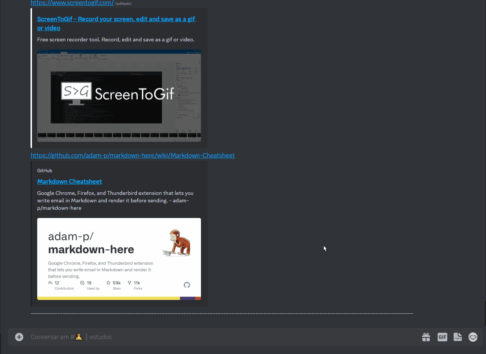

# Projeto de teste com README
Um projeto de teste com DevQuest ✨ { Atalho emoji " win + . " }

Título e descrição é fundamental


[]

## Tecnologia utilizadas

- HTML
- CSS
- JavaScript

## Como utilizar 

1 Clone projeto

```
git clone <url> 
```

2 Acesse a pasta do projeto

```
cd readme
```

### Markdown Cheatsheet

<a href="https://github.com/adam-p/markdown-here/wiki/Markdown-Cheatsheet" alt="Link de readme.md" target="_blank">Acesse esse link para saber mais sobre readme.md